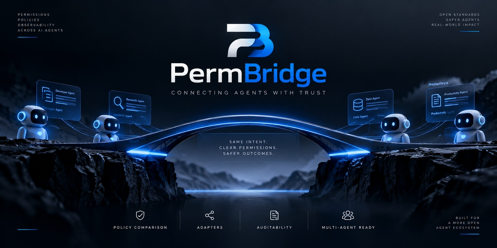

# PermBridge

**PermBridge means Permission Bridge.** PermBridge is a developer-first policy
compatibility layer for AI coding agents. Define permissions once, compare how
different agents enforce them, detect security gaps and unsupported rules, and
maintain a consistent security posture across coding tools.

Coding agents can have different permission models, configuration formats,
approval mechanisms, and security guarantees. Switching agents can therefore
change a developer's effective security posture. PermBridge is designed to
make those differences visible and actionable.

> **Current status:** Core has an experimental in-memory policy model and
> adapter contract. Read-only Codex and Claude Code adapters inspect selected
> local configuration files, but do not prove runtime enforcement. PermBridge
> can load a version-1 YAML policy and compare the resulting desired policy
> with one adapter posture, but does not produce user diagnostics, intercept
> actions, mediate approvals, or integrate with VS Code. It provides no security
> protection today.



The image is concept artwork for the planned product, not a claim that its
depicted capabilities are implemented.

## Product direction

The intended flow is:

```text
Desired policy -> canonical model -> agent adapter -> effective posture
               -> comparison -> diagnostics -> report
```

The canonical model expresses desired permissions independently of any
agent. Adapters interpret supported native configurations and report their
limitations. Core compares in-memory desired rules with adapter observations
capability by capability. Future diagnostics and reports
will explain gaps and possible remediation. The CLI is the first planned user
experience; the VS Code extension comes later.

PermBridge is focused on policy compatibility, posture comparison, and
portability across coding agents. Enforcement or mediation is only a future
possibility where an underlying agent provides a reliable mechanism. This is
not a universal sandbox or a general AI-agent firewall.

## What is implemented

- A Rust workspace containing `permbridge-core`, two experimental agent
  adapters, and a `permbridge-cli` smoke program.
- An experimental, UI-independent in-memory policy model for filesystem,
  network, and execution decisions, plus policy scope and enforcement strength.
- A strict, versioned YAML loader for one explicitly supplied desired policy.
  See the [policy format](docs/policy-format.md); loading does not enforce it.
- An `AgentAdapter` trait and observation types that distinguish declared,
  missing, unsupported, and ambiguous mappings.
- An experimental read-only Codex adapter for selected user and trusted-project
  TOML settings. It reports file provenance and conservative filesystem
  observations; see [Codex compatibility](docs/compatibility/codex.md).
- An experimental read-only Claude Code adapter for selected user and project
  JSON settings. It reports provenance and uncertainty for broad capabilities;
  see [Claude Code compatibility](docs/compatibility/claude-code.md).
- An experimental, provider-agnostic in-memory comparator that preserves
  decision relationships, evidence limits, and missing observations. See
  [posture comparison](docs/comparison.md).
- Rust CI, validated YAML examples, and a placeholder for the future
  TypeScript VS Code extension.

The CLI only prints a scaffold notice. It does not invoke either adapter or
calculate a comparison result.

## Development

Install stable Rust with the `rustfmt` and `clippy` components. Node.js and
VS Code are not needed for this skeleton.

```sh
cargo fmt --all -- --check
cargo clippy --workspace --all-targets -- -D warnings
cargo check --workspace --all-targets
RUSTDOCFLAGS="-D warnings" cargo doc --workspace --no-deps
cargo build --workspace --all-targets
cargo test --workspace --all-targets
cargo run -p permbridge-cli
```

Run the validation commands before committing and pushing. GitHub Actions
repeats the same quality gates on Ubuntu for pushes to `main` and pull requests
targeting `main`; a passing run does not establish a security guarantee. See
[testing and validation](docs/testing.md).

The last command is a smoke test, not an operational CLI. There is no
installation or full configuration workflow for end users yet. The YAML under
`policies/examples/` can be loaded through the Core API, but has no effect on
an agent by itself.

## Licensing and authorship

PermBridge is authored and maintained by Julián López Jiménez. The current
repository is source-available under [Business Source License 1.1](LICENSE),
with no Additional Use Grant. It permits inspection, copying, modification,
redistribution, and non-production use, including learning, evaluation, and
testing. Production use before the applicable Change Date requires a separate
commercial agreement with the Licensor. BSL 1.1 is not an OSI Open Source
license before that date.

Each version changes to Apache License 2.0 four calendar years after its Git
commit timestamp, or the fourth anniversary of first public distribution if
earlier. See [licensing details](docs/licensing.md) and the
[authorship notice](NOTICE). Earlier published versions remain available under
their original MIT terms; this change does not revoke those grants.

Bug reports, documentation problems, and suggestions are welcome through
GitHub Issues. External pull requests and code contributions are not accepted;
see the [contribution policy](CONTRIBUTING.md).

## Policy and roadmap

The model represents managed, global, project, and session policy scopes.
Global and optional project policies are intended to combine without allowing
the project policy to weaken a global restriction. Canonical decisions are
`ALLOW`, `ASK`, and `DENY`, with `DENY > ASK > ALLOW`; new policies default to
`ASK`. Merging scopes and evaluating actions are not implemented. Agent
adapters must not assume every native permission model has identical states.

The next milestones are automatic policy discovery and scope merging, behavior
evidence for the adapters, and useful CLI diagnostics. A localized
VS Code experience is later work. See the
[roadmap](docs/roadmap.md) for explicit boundaries.

## Repository map

| Path | Purpose |
| --- | --- |
| `crates/permbridge-core/` | Canonical Rust model, YAML loader, adapter contract, and in-memory comparator |
| `crates/permbridge-cli/` | Rust CLI smoke program; future user CLI |
| `crates/permbridge-codex/` | Experimental read-only Codex file adapter |
| `crates/permbridge-claude-code/` | Experimental read-only Claude Code file adapter |
| `adapters/` | Index for agent integrations |
| `extensions/vscode/` | Future TypeScript extension placeholder |
| `policies/examples/` | Valid version-1 desired-policy examples |
| `docs/` | Canonical English technical documentation |
| `tests/` | Reserved for future cross-crate integration tests |
| `.github/workflows/` | Rust CI |

Read the [architecture](docs/architecture.md),
[canonical policy model](docs/canonical-policy-model.md), and
[adapter contract](docs/adapter-contract.md) and
[posture comparison](docs/comparison.md) for the design and its limits.
The [documentation index](docs/README.md) lists the other engineering guides. See
[contributing](CONTRIBUTING.md) and [security reporting](SECURITY.md) before
participating.
